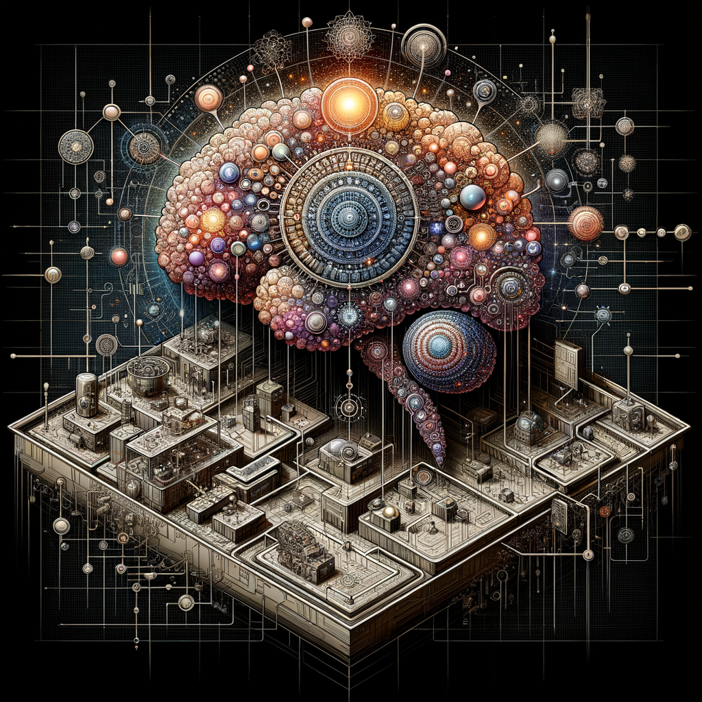
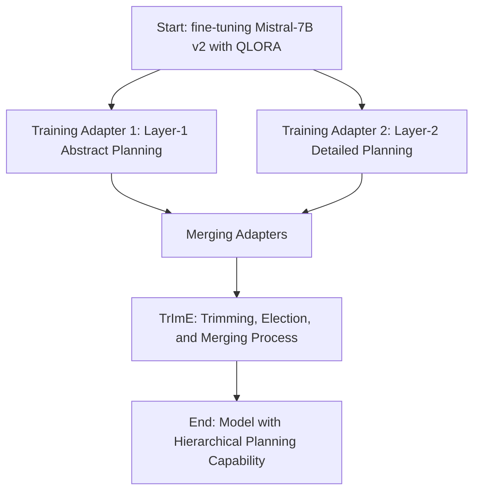

# Advancing Hierarchical Planning in Multi-Modal Task Decomposition Through Fine-Tuning Open Source LLMs



Welcome to the repository dedicated to pioneering research in the realm of artificial intelligence, focusing on hierarchical planning and multi-modal task decomposition using an advanced fine-tuning process on the Mistral-7B version 2 Large Language Model (LLM). Here, you will find a comprehensive collection of resources, including the source code, dataset, and methodology used to achieve this groundbreaking work.

## Overview

This project introduces a novel approach to equipping LLMs with hierarchical planning capabilities for decomposing composite tasks into multi-layer, actionable subtasks. By leveraging a custom dataset and employing sophisticated fine-tuning processes such as Quantized Low Rank Adapters (QLORA) and a unique TrImE (Trimming, Election, and Merging) process, we have successfully demonstrated a two-layer hierarchical planning mechanism. This enables our fine-tuned LLM to orchestrate complex, multi-modal tasks across different layers of abstraction, a critical advancement for the development of intelligent orchestrator agents.

### Main Contributions
- **First Open Source LLM with Hierarchical Planning**: We present the first publicly available LLM fine-tuned to perform hierarchical planning for multi-modal task decomposition.
- **Innovative Dataset for Hierarchical Planning**: Our custom-built dataset, tailored for learning two-layer planning for multi-modal task decomposition, sets a new standard in the field.

### Key Features
- **Two-Layer Planning**: Our model adeptly decomposes composite tasks into an abstract layer of keywords and modes, followed by a detailed layer outlining actionable subtasks and their sequences.
- **Multi-Modal Task Support**: The dataset and resulting model are proficient in handling tasks that span across text, image, video, and audio modalities, showcasing versatility in task decomposition.
- **Open Source Access**: We provide unrestricted access to all training source code, adapters, and a portion of the dataset, along with comprehensive documentation on the training and fine-tuning processes.

## Repository Contents
- **Training Source Code**: Complete source code for fine-tuning the Mistral-7B v2 LLM, including the implementation of QLORA and the TrImE process.
- **Adapters and Datasets**: Pre-trained adapters (will be available in HuggingFace) and a 1000-row sample of our groundbreaking dataset designed for hierarchical planning of multi-modal task decomposition.
- **Evaluation Results**: Detailed benchmarks and evaluation results showcasing the effectiveness of the multi-layer planning approach.
- **Mermaid Diagram**: Visual representation of the fine-tuning and training workflow for enhanced understanding.

## Quick Start
To begin exploring and utilizing this revolutionary approach to hierarchical planning in LLMs, please refer to the `notebooks`.

## Mermaid Workflow Diagram
Below is a mermaid diagram illustrating the fine-tuning and training process devised for our project:



## Citation
If our work assists or inspires your research, please cite this project using the following:

```bibtex
@misc{hierarchical_planning_2024,
  title={Advancing Hierarchical Planning in Multi-Modal Task Decomposition Through Fine-Tuning Open Source LLMs},
  author={Arash Shahmansoori},
  year={2024},
  howpublished={\url{https://github.com/arash-shahmansoori/hierarchical_planning_decompose_net.git}},
}
```

## License
This project is open source and available under the [MIT License](LICENSE).

---
We are excited to share our advancements with the community and eagerly anticipate the innovative applications and further research this project will inspire.
