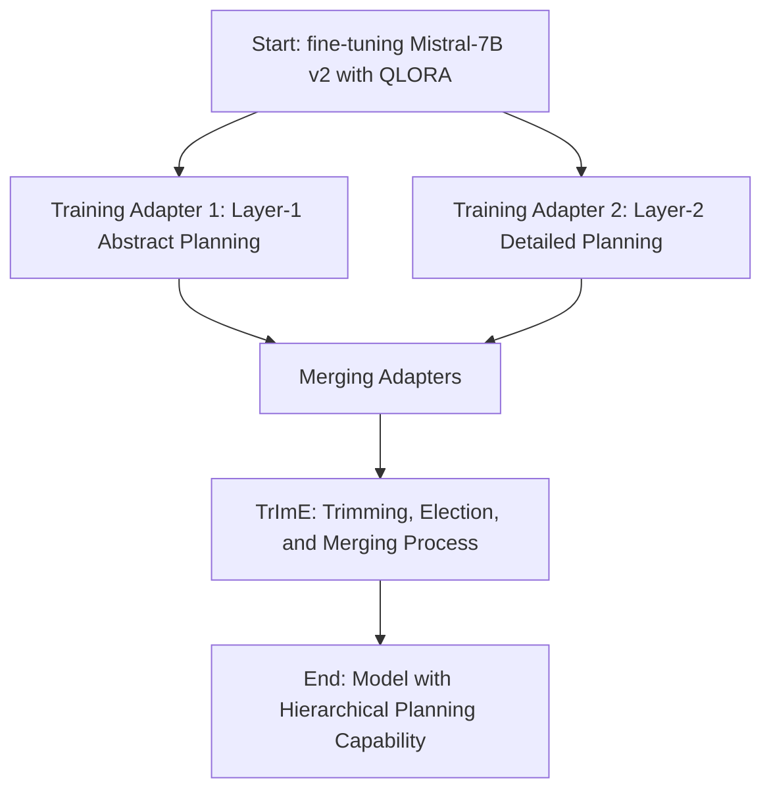
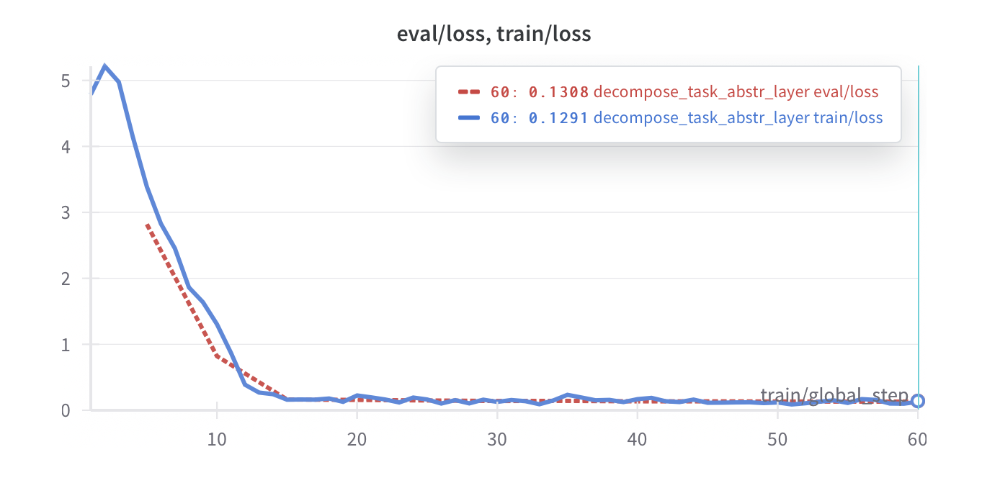
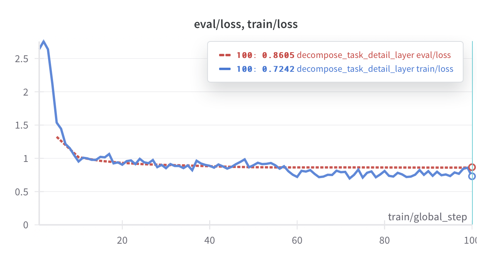

# Advancing Hierarchical Planning in Multi-Modal Task Decomposition Through Fine-Tuning Open Source LLMs


## Introduction

In the rapidly evolving landscape of artificial intelligence (AI), the ability to efficiently and effectively decompose complex, multi-modal composite tasks into clearly defined, actionable subtasks remains a pivotal challenge. This capability is especially crucial for enhancing the functionality and autonomy of AI systems in real-world applications, ranging from autonomous vehicles navigating dynamic environments to sophisticated infrastructure for managing smart cities. To address this challenge, we introduce a groundbreaking approach to multi-layer hierarchical planning for task decomposition using a fine-tuned version of an open-source Large Language Model (LLM) named Mistral with 7B version 2. This enhancement leverages a custom dataset meticulously crafted for instilling a two-layer hierarchical planning capability within the LLM, marking a significant milestone in AI's operational sophistication.

Our work centers on the development and deployment of the first open-source LLM with specialized hierarchical planning capabilities tailored for multi-modal task decomposition. By orchestrating a two-stage learning process, our model first identifies the core components and their sequence within a composite task before detailing them into precise, operational subtasks. This dual-layered abstraction not only enriches the model's understanding and execution of complex tasks but also pioneers a novel dataset design focused on hierarchical planning across multiple modalities—text, image, video, and audio.

A pivotal aspect of our contribution is the comprehensive open sourcing of the entire fine-tuning ecosystem—including the training source code, adapter configurations, and the innovative Quantized Low Rank Adapters (QLORA) methodology, alongside a meticulously assembled dataset following the alpaca format. This repertoire not only facilitates transparency and reproducibility but also sets a new precedent for collaborative advancements in the field.

Our model transcends traditional LLM applications, positioning itself as a potent orchestrator or controller agent within hierarchical swarms of AI agents. This capability is indispensable for the effective distribution and management of subtasks among disparate agents, ensuring a cohesive and efficient execution of complex, multi-layered tasks with varying degrees of abstraction. The orchestrated approach elevates the operational capacity of AI systems, enabling more nuanced and sophisticated responses to complex scenarios.

In summary, our work contributes to the field of AI by introducing (1) the first open-source LLM with hierarchical planning capabilities for multi-modal task decomposition, (2) a novel dataset designed to foster advancements in hierarchical planning across multiple modalities, and (3) an open-source repository featuring the training code, adapters, and results, empowering researchers and practitioners alike to explore, extend, and innovate upon our foundational work. These contributions not only advance our understanding and application of LLMs but also underscore the critical role of hierarchical planning in the orchestration of AI agents, heralding a new era of AI-driven solutions for complex, real-world challenges.

## Proposed Method

Our approach introduces a pioneering method for fine-tuning an open-source large language model (LLM), specifically Mistral-7B v2, to imbue it with the capability of hierarchical planning for multi-modal task decomposition. This method is critical for orchestrating tasks among various agents within a hierarchical swarm, marking a significant stride in the development of controller or orchestrator agents. The proposed method elegantly traverses through the stages of adapting the LLM, refining its learning, and ultimately achieving a nuanced understanding of task decomposition across multiple layers of abstraction. We leverage the potent combination of QLORA and a bespoke, intricately designed dataset to train the LLM. Our contributions are multifaceted, including the first open-source LLM with hierarchical planning capabilities for multi-modal task decomposition, the design of a specialized dataset for this purpose, and the provision of open-source code alongside adapters' checkpoints and results.

Our methodology unfolds as follows, depicted through a Mermaid Markdown DIAGRAM for clarity:



1. **Start by Fine-tuning Mistral-7B v2 with QLORA:** We initiate our methodology by applying QLORA to the Mistral-7B v2 model, preparing it for specialized training.

2. **Training Two Distinct Adapters:**
    - **Layer-1 Abstract Planning Adapter:** Dedicated to learning the decomposition of multi-modal composite tasks into keywords, modes for each subtask, and their ordered sequence for task completion.
    - **Layer-2 Detailed Planning Adapter:** Focused on distilling tasks into detailed actionable subtasks, outlining the necessary steps for completing the composite task in order.

3. **Merging Adapters:** Following separate training, both adapters undergo a merging process. This is a critical phase where the unique capabilities of each adapter are unified, allowing for a comprehensive understanding of both abstract and detailed planning layers.

4. **TrImE Process (Trimming, Election, and Merging):** Post-merging, the adapters are subjected to TrImE, a refinement operation where redundant parameters are trimmed and conflicting signals resolved. This step ensures that the merged adapter functions optimally, embodying both layers of hierarchical planning efficiently.

5. **End Result - Model with Hierarchical Planning Capability:** The culmination of this process is an LLM uniquely capable of hierarchical planning for multi-modal task decomposition. This model stands as the first of its kind, offering unparalleled support for orchestrating complex tasks among swarms of agents across various abstraction levels.

The open-source nature of our codebase, alongside the adapters' checkpoints and detailed results, not only underscores our commitment to the broader research community but also provides a robust foundation for further advancements in hierarchical planning and multi-modal task decomposition. Through this method, we establish a new benchmark for controller and orchestrator agents, setting the stage for innovative applications in complex, dynamic environments.

## Results

**All source code, datasets, scripts, notebooks, and evaluation results are publicly available at: [my github url].**

### Setup

The fine-tuning of the LLM, specifically `mistralai/Mistral-7B-Instruct-v0.2`, was carried out using innovative QLORA, optimizing for efficiency and performance. This is pivotal in learning hierarchical planning structures for multi-modal task decomposition. We utilized `gpt-4-turbo-preview` in crafting our dataset, ensuring a broad spectrum of multi-modal scenarios. Details on the hyperparameters used in the fine-tuning process are accessible at the provided GitHub URL, offering transparency and opportunities for replication or further development. The fine-tuning process utilized the NVIDIA V100 GPU.

### Quality of the Fine-Tuned Model

The application of our fine-tuning method on `mistralai/Mistral-7B-Instruct-v0.2` using QLORA demonstrated exceptional advancement in hierarchical planning capabilities for multi-modal task decomposition. Comparative analysis reveals that our fine-tuned model significantly outperforms the original model's, often fragmented or irrelevant, output.

The processed model adeptly decomposes complex composite tasks into ordered, actionable subtasks across different layers of abstraction with heightened relevance and coherence as demonstrated below.

```
Layer-1 Abstract Planning:

1. Product photography: Image.
2. Testimonial videos: Video.
3. Blog posts: Text.
4. Background sounds: Audio.


Layer-2 Detailed Planning:

1. Product Photography: Capture high-quality images of the eco-friendly product line. Ensure the photos showcase the unique features and benefits of the products. Use natural lighting and minimalistic backgrounds to emphasize the eco-friendliness.
2. Testimonial Videos: Record and edit videos of early users sharing their experiences with the product line. Focus on their positive feedback, the impact the products have had on their lives, and how they align with the eco-friendly values.
3. Blog Posts: Write and publish blog posts that highlight the sustainability aspects of the product line. Include information on the materials used, production processes, and the environmental benefits. Use engaging storytelling to connect with readers and encourage sharing.
4. Background Sounds: Create a series of soothing background sounds for IG stories. These sounds should be calming, eco-friendly, and complementary to the brand image. Use natural sounds like rain, wind, or birds chirping to evoke a sense of tranquility and connection to nature.
```

### Training and Validation Losses

Throughout the training period, we observed both training and validation losses exhibiting a consistent downward trend, underscoring the model's effective learning trajectory. This decline was more pronounced in learning layer-1 abstract planning for multi-modal task decomposition.

The model showed a quicker aptitude in grasping abstract concepts and sequencing events to complete composite tasks.



Subsequently, layer-2 detailed planning, although initially slower, demonstrated substantial progress over time, indicating the model's growing proficiency in decomposing tasks into more granular actions.



This efficient reduction in both training and validation losses throughout the fine-tuning process highlights the high quality of the dataset and the crafted prompts. It also reflects the efficacy of our fine-tuning methodology, which accords the model the ability to navigate complex hierarchical planning tasks with enhanced precision and understanding.

### Novel Contributions

Our work introduces the first open-source LLM with explicit hierarchical planning capabilities for multi-modal task decomposition, alongside a uniquely designed dataset. These contributions not only mark a significant stride in LLM development but also pave the way for more sophisticated AI-driven task management and decomposition approaches in multi-modal environments.

In summary, our fine-tuned model showcases remarkable improvements in hierarchical planning for multi-modal task decomposition, evidenced by superior performance in task understanding, planning, and the execution sequence of subtasks. The consistent reduction in loss metrics further corroborates the model's efficiency and the effectiveness of our fine-tuning and dataset design strategies.

## Conclusions

In this groundbreaking exploration, we have successfully fine-tuned an existing LLM, Mistral-7B, to pioneer the domain of hierarchical planning for task decomposition, specifically focusing on multi-modal composite tasks. Through innovative adaptation and the design of a bespoke dataset, we leveraged advanced technologies such as QLORA to teach the model two-layer hierarchical planning. This process efficiently breaks down complex tasks into manageable subtasks with varying layers of abstraction, a novel approach in orchestrating task execution among multiple agents.

Our work represents the first instance of an open-source LLM possessing such hierarchical planning capabilities for decomposing multi-modal tasks. The significance of this advancement cannot be overstated, as it introduces a level of task understanding and decomposition previously unattainable. By structuring the learning process into two distinct layers, our model not only identifies but also organizes the sequence of subtasks with a high degree of accuracy and detail, from broad categorization to actionable steps.

The key contributions of our endeavor include the presentation of the first open-source LLM fine-tuned with hierarchical planning for decomposing multi-modal tasks and the curation of a dedicated dataset designed to facilitate the learning of this complex task decomposition. This dataset follows the versatile alpaca format, capable of encompassing a wide array of multi-modal scenarios, thus significantly enhancing the model’s understanding and execution abilities.

Moreover, the openness of our method, including the sharing of training source code, adapters, and the meticulously documented adapter optimization process (trimming, election, and merging), demonstrates our commitment to contributing to the field's collective knowledge. The provision of our dataset, which includes a diverse range of task complexity and modalities, along with detailed evaluation results, underscores our research's potential impact.

In conclusion, the introduction of hierarchical planning capabilities into an LLM for task decomposition heralds a new era in artificial intelligence applications, specifically in designing advanced orchestrator agents capable of handling sophisticated task decompositions. By opening our methodologies and findings, we invite further exploration, validation, and expansion upon our work, with the hope of spurring advancements across the realms of machine learning and artificial general intelligence.

## References

[1]: A. Shahmansoori, Advancing Hierarchical Planning in Multi-Modal Task Decomposition Through Fine-Tuning Open Source LLMs, https://github.com/arash-shahmansoori/hierarchical_planning_decompose_net.git, 2024.
